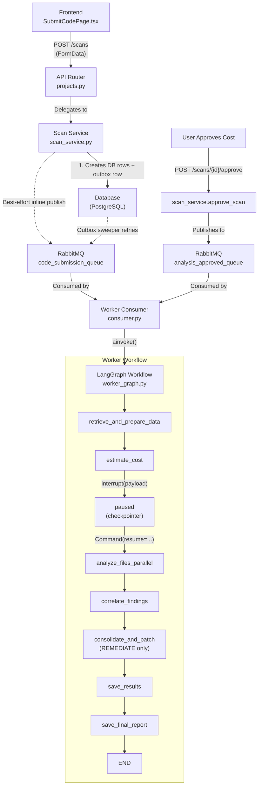

# File Scanning Flow — End-to-End Walkthrough

## Architecture Overview



---

## Phase 1 — Frontend Submission

**File:** `secure-code-ui/src/pages/submission/SubmitCodePage.tsx`

The user picks one of three submission methods:
1. **Direct file uploads** — select individual source files
2. **Git repository** — provide a repo URL (files are previewed via `POST /scans/preview-git`)
3. **Archive upload** — upload a `.zip`/`.tar.gz` (files previewed via `POST /scans/preview-archive`)

They also select:
- **Project name** (existing or new)
- **Scan type** — `AUDIT`, `SUGGEST`, or `REMEDIATE`
- **LLM configs** — utility, fast, and reasoning model selections
- **Frameworks** — which security frameworks to scan against (e.g., ASVS, OWASP Cheatsheets)
- **Selected files** — optionally filter to a subset

**API call:** `scanService.createScan` (`secure-code-ui/src/shared/api/scanService.ts`) sends a `POST /scans` with `FormData`.

---

## Phase 2 — API Router

**File:** `src/app/api/v1/routers/projects.py` — `create_scan` endpoint

- Validates that **exactly one** submission method is provided
- Parses `frameworks` and `selected_files` from comma-separated strings
- Delegates to the appropriate `SubmissionService` method:
  - `create_scan_from_uploads()` for files
  - `create_scan_from_git()` for repos
  - `create_scan_from_archive()` for archives
- Returns a `ScanResponse` with `scan_id`, `project_id`, and a status message

---

## Phase 3 — Backend Service

**File:** `src/app/core/services/scan_service.py`

### Core Processing (`_process_and_launch_scan`)

| Step | Action | Details |
|------|--------|---------|
| 1 | **Get/create project** | Finds existing project by name or creates a new one |
| 2 | **Deduplicate source files** | Hashes file contents; stores new ones, reuses existing |
| 3 | **Create Scan record** | DB row with project link, scan type, LLM config IDs, frameworks |
| 4 | **Create code snapshot** | `ORIGINAL_SUBMISSION` snapshot linking scan to the file map |
| 5 | **Add QUEUED event** | Timeline event marking the scan as queued |
| 6 | **Insert outbox row** | `scan_outbox` row in the **same transaction** as steps 3–5; closes the API-commits-then-publish-fails race |
| 7 | **Best-effort inline publish** | Try to publish to `code_submission_queue` immediately; if it fails, the outbox sweeper picks it up later |

---

## Phase 4 — Worker Consumer

**File:** `src/app/workers/consumer.py`

- Runs in a separate Docker container with a **Pika** (RabbitMQ) blocking consumer
- Listens on three queues: `code_submission_queue`, `analysis_approved_queue`, `remediation_trigger_queue`
- On message receipt:
  1. Parses `scan_id` from the message body
  2. Creates an initial `WorkerState` dict
  3. Schedules `run_graph_task_wrapper` on an async event loop
- `run_graph_task_wrapper` gets the compiled LangGraph workflow and calls `ainvoke()`
  - For approval/remediation messages it passes `Command(resume=payload)` so the existing checkpointed thread continues
- On success → ACKs the RabbitMQ message; on failure → NACKs and sets scan status to `FAILED`

---

## Phase 5 — LangGraph Worker Workflow

**File:** `src/app/infrastructure/workflows/worker_graph.py`

Compiled as a **LangGraph `StateGraph`** with an `AsyncPostgresSaver` checkpointer keyed on `scan_id`. The wired graph today is:

```
retrieve_and_prepare_data
  → estimate_cost            (interrupt → resume via Command)
  → analyze_files_parallel
  → correlate_findings
  → consolidate_and_patch    (no-op for AUDIT / SUGGEST)
  → save_results
  → save_final_report → END
```

`handle_error` is reachable from every node via the `should_continue` conditional edges and sets status `FAILED`.

### Node 1 — `retrieve_and_prepare_data`

- Fetches the scan and its `ORIGINAL_SUBMISSION` snapshot from DB
- Retrieves the actual source file contents by hash
- Builds a **Repository Map** (symbol-level index of the codebase) via tree-sitter
- Builds a **Dependency Graph** (import relationships via `ContextBundlingEngine`)
- Resolves the **relevant agents** for the selected frameworks into `all_relevant_agents`
- Persists the repo map + dependency graph as scan artifacts
- Updates status to `ANALYZING_CONTEXT`

### Node 2 — `estimate_cost`

- Walks files in topological order over the dependency graph
- Chunks files larger than `CHUNK_ONLY_IF_LARGER_THAN` (~150 000 chars / ~37 500 tokens) using `semantic_chunker`; small files go through as a single chunk
- Counts input tokens for each chunk × each relevant agent via `litellm.token_counter`
- Prices the dry run via `litellm.cost_per_token` (or per-`LLMConfiguration` admin override)
- Persists `cost_details` and updates status to `PENDING_COST_APPROVAL`
- Calls **native `interrupt({"scan_id", "estimated_cost"})`** — the LangGraph runtime serializes state into the Postgres checkpointer and pauses execution

### Approval bridge

When the user approves (via `POST /scans/{id}/approve`):
1. `scan_service.approve_scan` validates the scan is in `PENDING_COST_APPROVAL`
2. Updates status to `QUEUED_FOR_SCAN`
3. Publishes to `analysis_approved_queue`
4. The worker invokes `ainvoke(Command(resume=payload), config={"configurable": {"thread_id": scan_id}})` — execution continues **inside** `estimate_cost` from where `interrupt()` paused, then falls straight through to `analyze_files_parallel`

### Node 3 — `analyze_files_parallel`

**Single-pass**, **fully parallel** analysis (D.5 / F.5.2 decision). Key properties:

- **Every file is analyzed in parallel.** No topological ordering, no cross-file patch propagation. All agents see `live_codebase` (the `ORIGINAL_SUBMISSION` snapshot content).
- **Per-file agent triage** happens inline via `resolve_agents_for_file(file_path, all_relevant_agents)` — extension-based routing, not a separate LLM triage node.
- **Per-file dependency context** is still injected via `build_dep_summary` — symbol signatures from successors in the dependency graph are prefixed to each chunk so agents have visibility into imported files even though they don't see patched dependents.
- **Concurrency** is bounded by a single `asyncio.Semaphore(CONCURRENT_LLM_LIMIT=5)` over the union of file × chunk × agent calls.
- **No mid-graph DB writes.** Findings + `proposed_fixes` flow through state to `consolidate_and_patch_node` and `save_results_node`.

### Node 4 — `correlate_findings`

- Groups findings by `(file_path, CWE, line_number)` signature
- Single-agent groups pass through with `corroborating_agents = [agent_name]`
- Multi-agent groups merge into the highest-severity finding with `confidence = "High"` and the union of agent names
- Preserves `is_applied_in_remediation` if any contributor had it set

### Node 5 — `consolidate_and_patch`

For **REMEDIATE** scans:
- Groups `proposed_fixes` collected by `analyze_files_parallel` by file
- Detects line-range conflicts and runs `_run_merge_agent` to resolve overlaps
- Tree-sitter syntax-verifies the patched content (`_verify_syntax_with_treesitter`)
- Builds `final_file_map` for the `POST_REMEDIATION` snapshot saved by `save_results_node`

For **AUDIT** it's a no-op. For **SUGGEST** the correlated findings keep their embedded `fixes` field (so the UI shows suggested fixes) but no `POST_REMEDIATION` snapshot is built.

### Node 6 — `save_results`

- Bulk-inserts correlated findings (AUDIT/SUGGEST) or updates existing rows with correlation data (REMEDIATE)
- Persists the `POST_REMEDIATION` snapshot for REMEDIATE

### Node 7 — `save_final_report`

- Computes `severity_counts` for the `summary` JSON
- Computes a unified 0–10 `risk_score` via `app.shared.lib.risk_score.compute_cvss_aggregate` (rounded to int for the `Scan.risk_score` `Integer` column). The aggregator uses a strict fallback ladder: parsed `CVSS3(cvss_vector)` → numeric `cvss_score` → severity-tier weight (CRITICAL=9.5, HIGH=7.5, MEDIUM=5.0, LOW=2.5, else=0.0) → 0.0; the final score is `max(highest_score, severity_tier_weighted_average)` capped at 10.0
- The same function feeds `dashboard_service._risk_score` and `compliance_service._score_from_aggregate`, mapped to the legacy 0–100 posture scale via `to_posture_score` so API JSON shapes are unchanged
- Bad CVSS vectors fall through silently (logged WARN with finding id + truncated vector only); the node never raises
- Persists the `summary` JSON
- Sets final status: `COMPLETED` or `REMEDIATION_COMPLETED`

---

## Status Lifecycle

```
QUEUED → ANALYZING_CONTEXT → PENDING_COST_APPROVAL
                                  ↓ (user approves)
                            QUEUED_FOR_SCAN → ANALYZING_CONTEXT → RUNNING_AGENTS
                                  → COMPLETED / REMEDIATION_COMPLETED
```

If any error occurs at any node, the `handle_error` node sets the status to `FAILED`.

---

## Removed in the 2026-04-26 cleanup

- **`run_impact_reporting` node** + the `ImpactReportingAgent` sub-graph. The node was registered but never wired into the graph, so impact summaries were never being produced. The agent + the `Scan.impact_report` JSONB column have been deleted; the executive-summary PDF endpoint that depended on them is gone.
- **SARIF generation.** `Scan.sarif_report`, the `/scans/{id}/sarif` endpoint, and the SARIF download in the UI have been removed for now. To re-introduce: re-add the column via Alembic migration, wire a generation node back into the graph between `save_results` and `save_final_report`, and restore the route + UI.

As of 2026-04-26, the per-scan `risk_score` and the Dashboard / Compliance posture scores share a single underlying calculation (`app.shared.lib.risk_score.compute_cvss_aggregate`) — the worker persists it as a 0–10 integer (intensity view) and the services map it to a 0–100 posture (`to_posture_score`, higher = healthier). Same math, two views.
