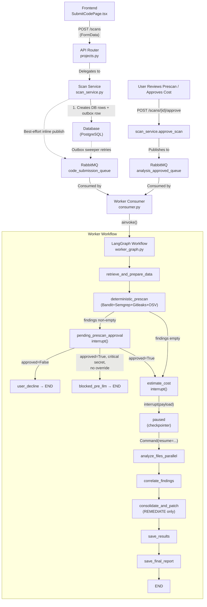

# File Scanning Flow — End-to-End Walkthrough

## Architecture Overview



---

## Phase 1 — Frontend Submission

**File:** `secure-code-ui/src/pages/submission/SubmitCodePage.tsx`

The user picks one of three submission methods:
1. **Direct file uploads** — select individual source files
2. **Git repository** — provide a repo URL (files are previewed via `POST /scans/preview-git`)
3. **Archive upload** — upload a `.zip`/`.tar.gz` (files previewed via `POST /scans/preview-archive`)

They also select:
- **Project name** (existing or new)
- **Scan type** — `AUDIT`, `SUGGEST`, or `REMEDIATE`
- **LLM configs** — utility, fast, and reasoning model selections
- **Frameworks** — which security frameworks to scan against (e.g., ASVS, OWASP Cheatsheets)
- **Selected files** — optionally filter to a subset

**API call:** `scanService.createScan` (`secure-code-ui/src/shared/api/scanService.ts`) sends a `POST /scans` with `FormData`.

---

## Phase 2 — API Router

**File:** `src/app/api/v1/routers/projects.py` — `create_scan` endpoint

- Validates that **exactly one** submission method is provided
- Parses `frameworks` and `selected_files` from comma-separated strings
- Delegates to the appropriate `SubmissionService` method:
  - `create_scan_from_uploads()` for files
  - `create_scan_from_git()` for repos
  - `create_scan_from_archive()` for archives
- Returns a `ScanResponse` with `scan_id`, `project_id`, and a status message

---

## Phase 3 — Backend Service

**File:** `src/app/core/services/scan_service.py`

### Core Processing (`_process_and_launch_scan`)

| Step | Action | Details |
|------|--------|---------|
| 1 | **Get/create project** | Finds existing project by name or creates a new one |
| 2 | **Deduplicate source files** | Hashes file contents; stores new ones, reuses existing |
| 3 | **Create Scan record** | DB row with project link, scan type, LLM config IDs, frameworks |
| 4 | **Create code snapshot** | `ORIGINAL_SUBMISSION` snapshot linking scan to the file map |
| 5 | **Add QUEUED event** | Timeline event marking the scan as queued |
| 6 | **Insert outbox row** | `scan_outbox` row in the **same transaction** as steps 3–5; closes the API-commits-then-publish-fails race |
| 7 | **Best-effort inline publish** | Try to publish to `code_submission_queue` immediately; if it fails, the outbox sweeper picks it up later |

---

## Phase 4 — Worker Consumer

**File:** `src/app/workers/consumer.py`

- RAG retrieval inside `analyze_files_parallel` routes through `app.infrastructure.rag.factory.get_vector_store()` which returns the singleton `QdrantStore` (ADR-008). Embeddings come from `app.infrastructure.rag.embedder` (`fastembed` `sentence-transformers/all-MiniLM-L6-v2`, 384-dim).
- All node-level LLM calls are traced under a per-scan parent trace in **Langfuse** when `LANGFUSE_ENABLED=true` (`infrastructure/observability/`). Parent trace `id == X-Correlation-ID == correlation_id_var.get()` so Loki logs and Langfuse traces cross-reference. Path is fail-open — Langfuse outage never breaks a scan.
- Runs in a separate Docker container with an **`aio-pika`** async RabbitMQ consumer (`aio_pika.connect_robust`, single asyncio event loop — no thread bridge, no blocking I/O)
- Listens on three queues: `code_submission_queue`, `analysis_approved_queue`, `remediation_trigger_queue`, declared durable, `prefetch_count=1` (one scan at a time per worker)
- On message receipt (`_handle_message` → `async with message.process(requeue=False, ignore_processed=True)`):
  1. Parses `scan_id` from the message body and sets `correlation_id_var`
  2. Builds an initial `WorkerState` dict
  3. `await`s `_run_workflow_for_scan` inline — no `asyncio.run_coroutine_threadsafe` / `add_callback_threadsafe` dance
- `_run_workflow_for_scan` runs an idempotency precheck (skips already-completed/in-flight scans), then `await worker_workflow.ainvoke(state | Command(resume=…), config={"configurable": {"thread_id": scan_id}})` under a `SCAN_WORKFLOW_TIMEOUT_SECONDS` `asyncio.wait_for`
  - For approval/remediation messages it passes `Command(resume=payload)` so the checkpointed thread continues from `interrupt()`
- On success → message context-manager ACKs; on failure → explicit `await message.reject(requeue=False)` (poison messages don't loop) and the scan row is set to `FAILED` for UI visibility
- Outer consume loop is wrapped in exponential backoff (`_BACKOFF_START_SECONDS` → `_BACKOFF_CAP_SECONDS = 30s`) for the "broker down for minutes" case; per-op retries are handled by `connect_robust`

---

## Phase 5 — LangGraph Worker Workflow

**Files:** `src/app/infrastructure/workflows/worker_graph.py` (StateGraph wiring + routing + `get_workflow()` + back-compat re-exports), `src/app/infrastructure/workflows/state.py` (`WorkerState` / `RelevantAgent` TypedDicts), `src/app/infrastructure/workflows/nodes/*.py` (node implementations: `retrieve.py`, `prescan.py`, `cost.py`, `analyze.py`, `correlate.py`, `consolidate.py`, `results.py`, `error.py`). The string names registered via `workflow.add_node(...)` are part of the LangGraph checkpointer's on-disk contract — in-flight scans key off them.

Compiled as a **LangGraph `StateGraph`** with an `AsyncPostgresSaver` checkpointer keyed on `scan_id`. The wired graph today is:

```
retrieve_and_prepare_data
  → deterministic_prescan        (Bandit + Semgrep + Gitleaks + OSV-Scanner — no interrupt)
      → pending_prescan_approval (interrupt — fires when findings non-empty)
          → user_decline → END           (operator clicked Stop; status BLOCKED_USER_DECLINE)
          → blocked_pre_llm → END        (operator declined Critical-secret override; status BLOCKED_PRE_LLM)
          → estimate_cost                (approved; interrupt → resume via Command)
      → estimate_cost            (skip gate when findings empty; interrupt → resume via Command)
        → analyze_files_parallel
        → correlate_findings
        → consolidate_and_patch  (no-op for AUDIT / SUGGEST)
        → save_results
        → save_final_report → END
```

`handle_error` is reachable from every node via the `should_continue` conditional edges and sets status `FAILED`. `blocked_pre_llm` is reachable only from `_route_after_prescan_approval` (when the operator declines the Critical-secret override modal) and sets status `BLOCKED_PRE_LLM`. `user_decline` is reachable only from `_route_after_prescan_approval` (when the operator clicks Stop regardless of severity) and sets status `BLOCKED_USER_DECLINE`.

### Node 1 — `retrieve_and_prepare_data`

- Fetches the scan and its `ORIGINAL_SUBMISSION` snapshot from DB
- Retrieves the actual source file contents by hash
- Builds a **Repository Map** (symbol-level index of the codebase) via tree-sitter
- Builds a **Dependency Graph** (import relationships via `ContextBundlingEngine`)
- Resolves the **relevant agents** for the selected frameworks into `all_relevant_agents`
- Persists the repo map + dependency graph as scan artifacts
- Updates status to `ANALYZING_CONTEXT`

### Node 1.5 — `deterministic_prescan`

Deterministic SAST pre-pass that runs **before** the cost-approval interrupt and seeds `WorkerState.findings` with high-confidence ground-truth findings the LLM agents can corroborate.

- Wraps user-supplied files (`state["files"]`) into a fresh `tempfile.mkdtemp()` sandbox via `app.infrastructure.scanners.staging.stage_files`. Basenames are sanitized (strip `..`, leading `/`, leading `-` to neutralize argv injection, leading `.` to neutralize config-file hijack like `.semgrepignore` / `.gitleaks.toml`) so attacker-controlled paths can never reach the scanner argv.
- Routes per-file via `app.infrastructure.scanners.registry.scanners_for_file`:
  - **Bandit** for Python (`.py`, `.pyi`).
  - **Semgrep CE** for the multi-language subset its bundled `p/security-audit` pack covers (`.py`, `.js`, `.ts`, `.jsx`, `.tsx`, `.java`, `.go`, `.rb`, `.php`, `.cs`, `.c`, `.cpp`, `.h`, etc.).
  - **Gitleaks** for any text-shaped file (source + common config / docs).
  - **OSV-Scanner** for dependency manifests across the staged tree. Returns a `(findings, bom_cyclonedx_dict)` tuple; `bom_cyclonedx_dict` is persisted to `Scan.bom_cyclonedx` (JSONB, hard-capped at 5 MB with a `_truncated`/`_original_size_bytes` sentinel on overflow).
- Each scanner walks the staged tree itself; the prescan node fans out four subprocess invocations under a single shared `asyncio.Semaphore(CONCURRENT_SCANNER_LIMIT=5)` (N9). Per-scanner failure is non-fatal — the remaining scanners' findings still flow through.
- **Subprocess hardening (M1, N1–N3):** every invocation is `subprocess.run([...], shell=False, check=False, timeout=120)`; arguments are a literal list with `--` separator before user-derived paths; configs are pinned to bundled paths (`/app/scanners/configs/semgrep/security-audit.yml`, `/app/scanners/configs/gitleaks.toml`) so user-tree configs cannot redirect behavior; Semgrep gets `--metrics=off --disable-version-check --no-git-ignore`; Gitleaks gets `--redact --no-git`.
- **Output (M5 / M7 / N1):** parsed through strict Pydantic allowlists. Gitleaks's allowlist is the tightest — only `RuleID`, `File`, `StartLine`, `Description` cross the boundary; `Match`, `Secret`, `Fingerprint`, `Commit`, `Author`, `Email` are silently dropped even if present. Every `VulnerabilityFinding.description` is `html.escape()`d and capped at 200 chars before reaching any LLM prompt.
- **Resource caps (M6 / N2):** files larger than `PRESCAN_FILE_BYTE_LIMIT` (1 MiB) are skipped; minified web bundles (`*.min.js`, `*.bundle.js`, `*.min.css`) get a tighter `MINIFIED_BYTE_LIMIT` (256 KiB) to dodge Semgrep's parse pathology. Per-scanner 120 s subprocess timeout.
- **Prescan-approval gate (ADR-009):** when `findings` is non-empty after the prescan, `_route_after_prescan` routes to the new `pending_prescan_approval` node, which persists findings to DB and calls native `interrupt({"scan_id", "findings_count", "has_critical_secret"})`. The operator reviews findings on the scan-status page (via `GET /scans/{id}/prescan-findings`) and resumes by posting `{"kind": "prescan_approval", "approved": true/false, "override_critical_secret": true/false}` to `POST /scans/{id}/approve`. The post-resume router `_route_after_prescan_approval` dispatches: `approved=False` → `user_decline` (status `BLOCKED_USER_DECLINE`); `approved=True` with unacknowledged Critical Gitleaks secret → `blocked_pre_llm` (status `BLOCKED_PRE_LLM`); otherwise → `estimate_cost`. Scans parked at `PENDING_PRESCAN_APPROVAL` for >24 h are auto-declined by `prescan_approval_sweeper.py`.
- **Failure policy (N15):** unexpected prescan crash → log WARN with `correlation_id` + `findings: []` continuation; the graph proceeds to `estimate_cost` so the LLM analysis still runs. Scanner stdout is NEVER embedded in `Scan.error_message`.
- **MUST NOT call `interrupt()`** (M8 / N5). The prescan-approval pause sits at `pending_prescan_approval_node`; the cost-approval pause sits at `estimate_cost_node`. Both `blocked_pre_llm` and `user_decline` are terminal routes, not pauses. The prescan node itself must not pause — it only seeds findings into state for the approval gate.
- Findings ride through state to `save_results_node` (single save site). `analyze_files_parallel` extends rather than replaces `state["findings"]`; `correlate_findings_node` dedupes scanner + LLM overlaps by `(file_path, cwe, line_number)`.
- Provenance via `findings.source` column: `"bandit"` / `"semgrep"` / `"gitleaks"` for scanner findings; `NULL` for legacy LLM-agent rows; `"agent"` for new LLM rows once the backfill admin script runs.

### Node 1.5b — `pending_prescan_approval` (interrupt)

Reached from `_route_after_prescan` when `state["findings"]` is non-empty. Persists deterministic findings to DB and sets status `PENDING_PRESCAN_APPROVAL` **before** calling native `interrupt({"scan_id", "findings_count", "has_critical_secret"})` so the scan-status page can render findings while the worker thread is parked. On resume, the payload `{"approved", "override_critical_secret"}` is stamped into `state["prescan_approval"]` and `_route_after_prescan_approval` decides the next node.

### Node 1.5c — `user_decline` (terminal)

Reached from `_route_after_prescan_approval` when `approved=False`. Persists the deterministic prescan findings (so the results page shows them), sets `Scan.status = STATUS_BLOCKED_USER_DECLINE`, and the consumer's post-workflow cleanup deletes the LangGraph checkpointer thread (M5 / G7). Routes to `END`.

### Node 1.5d — `blocked_pre_llm` (terminal)

Reached from `_route_after_prescan_approval` when the operator approved but declined the Critical-secret override modal (`approved=True, override_critical_secret=False` and a Critical Gitleaks finding present). Persists the triggering finding via `ScanRepository.save_findings`; sets `Scan.status = STATUS_BLOCKED_PRE_LLM`; the consumer's post-workflow cleanup deletes the checkpointer thread; logs WARN with `scan_id`, scanner, rule, file, line for admin investigation via `/admin/findings?source=gitleaks`. Routes to `END`.

### Node 2 — `estimate_cost`

- Walks files in topological order over the dependency graph
- Chunks files larger than `CHUNK_ONLY_IF_LARGER_THAN` (~150 000 chars / ~37 500 tokens) using `semantic_chunker`; small files go through as a single chunk
- Counts input tokens for each chunk × each relevant agent via `litellm.token_counter`
- Prices the dry run via `litellm.cost_per_token` (or per-`LLMConfiguration` admin override)
- Persists `cost_details` and updates status to `PENDING_COST_APPROVAL`
- Calls **native `interrupt({"scan_id", "estimated_cost"})`** — the LangGraph runtime serializes state into the Postgres checkpointer and pauses execution

### Approval bridge

When the user approves (via `POST /scans/{id}/approve`):
1. `scan_service.approve_scan` validates the scan is in `PENDING_COST_APPROVAL`
2. Updates status to `QUEUED_FOR_SCAN`
3. Publishes to `analysis_approved_queue`
4. The worker invokes `ainvoke(Command(resume=payload), config={"configurable": {"thread_id": scan_id}})` — execution continues **inside** `estimate_cost` from where `interrupt()` paused, then falls straight through to `analyze_files_parallel`

### Node 3 — `analyze_files_parallel`

**Single-pass**, **fully parallel** analysis (D.5 / F.5.2 decision). Key properties:

- **Every file is analyzed in parallel.** No topological ordering, no cross-file patch propagation. All agents see `live_codebase` (the `ORIGINAL_SUBMISSION` snapshot content).
- **Per-file agent triage** happens inline via `resolve_agents_for_file(file_path, all_relevant_agents)` — extension-based routing, not a separate LLM triage node.
- **Per-file dependency context** is still injected via `build_dep_summary` — symbol signatures from successors in the dependency graph are prefixed to each chunk so agents have visibility into imported files even though they don't see patched dependents.
- **Concurrency** is bounded by a single `asyncio.Semaphore(CONCURRENT_LLM_LIMIT=5)` over the union of file × chunk × agent calls.
- **No mid-graph DB writes.** Findings + `proposed_fixes` flow through state to `consolidate_and_patch_node` and `save_results_node`.

### Node 4 — `correlate_findings`

- Groups findings by `(file_path, CWE, line_number)` signature
- Single-agent groups pass through with `corroborating_agents = [agent_name]`
- Multi-agent groups merge into the highest-severity finding with `confidence = "High"` and the union of agent names
- Preserves `is_applied_in_remediation` if any contributor had it set

### Node 5 — `consolidate_and_patch`

For **REMEDIATE** scans:
- Groups `proposed_fixes` collected by `analyze_files_parallel` by file
- Detects line-range conflicts and runs `_run_merge_agent` to resolve overlaps
- Tree-sitter syntax-verifies the patched content (`_verify_syntax_with_treesitter`)
- Builds `final_file_map` for the `POST_REMEDIATION` snapshot saved by `save_results_node`

For **AUDIT** it's a no-op. For **SUGGEST** the correlated findings keep their embedded `fixes` field (so the UI shows suggested fixes) but no `POST_REMEDIATION` snapshot is built.

### Node 6 — `save_results`

- Bulk-inserts correlated findings (AUDIT/SUGGEST) or updates existing rows with correlation data (REMEDIATE)
- Persists the `POST_REMEDIATION` snapshot for REMEDIATE

### Node 7 — `save_final_report`

- Computes `severity_counts` for the `summary` JSON
- Computes a unified 0–10 `risk_score` via `app.shared.lib.risk_score.compute_cvss_aggregate` (rounded to int for the `Scan.risk_score` `Integer` column). The aggregator uses a strict fallback ladder: parsed `CVSS3(cvss_vector)` → numeric `cvss_score` → severity-tier weight (CRITICAL=9.5, HIGH=7.5, MEDIUM=5.0, LOW=2.5, else=0.0) → 0.0; the final score is `max(highest_score, severity_tier_weighted_average)` capped at 10.0
- The same function feeds `dashboard_service._risk_score` and `compliance_service._score_from_aggregate`, mapped to the legacy 0–100 posture scale via `to_posture_score` so API JSON shapes are unchanged
- Bad CVSS vectors fall through silently (logged WARN with finding id + truncated vector only); the node never raises
- Persists the `summary` JSON
- Sets final status: `COMPLETED` or `REMEDIATION_COMPLETED`

---

## Status Lifecycle

```
QUEUED → ANALYZING_CONTEXT → PENDING_PRESCAN_APPROVAL
                                  ↓ (findings present; operator reviews)
                            ┌─── approved=False ──────────────────────────────→ BLOCKED_USER_DECLINE
                            ├─── approved=True, critical secret, no override → BLOCKED_PRE_LLM
                            └─── approved=True ───────────────────────────────→ PENDING_COST_APPROVAL
                                                                                      ↓ (cost approved)
                                                                               QUEUED_FOR_SCAN → ANALYZING_CONTEXT → RUNNING_AGENTS
                                                                                      → COMPLETED / REMEDIATION_COMPLETED

QUEUED → ANALYZING_CONTEXT → PENDING_COST_APPROVAL   (no prescan findings; gate skipped)
```

If any error occurs at any node, the `handle_error` node sets the status to `FAILED`. Scans stuck at `PENDING_PRESCAN_APPROVAL` for >24 h are auto-declined to `BLOCKED_USER_DECLINE` by `prescan_approval_sweeper.py`.

---

## Removed in the 2026-04-26 cleanup

- **`run_impact_reporting` node** + the `ImpactReportingAgent` sub-graph. The node was registered but never wired into the graph, so impact summaries were never being produced. The agent + the `Scan.impact_report` JSONB column have been deleted; the executive-summary PDF endpoint that depended on them is gone.
- **SARIF generation.** `Scan.sarif_report`, the `/scans/{id}/sarif` endpoint, and the SARIF download in the UI have been removed for now. To re-introduce: re-add the column via Alembic migration, wire a generation node back into the graph between `save_results` and `save_final_report`, and restore the route + UI.

As of 2026-04-26, the per-scan `risk_score` and the Dashboard / Compliance posture scores share a single underlying calculation (`app.shared.lib.risk_score.compute_cvss_aggregate`) — the worker persists it as a 0–10 integer (intensity view) and the services map it to a 0–100 posture (`to_posture_score`, higher = healthier). Same math, two views.
